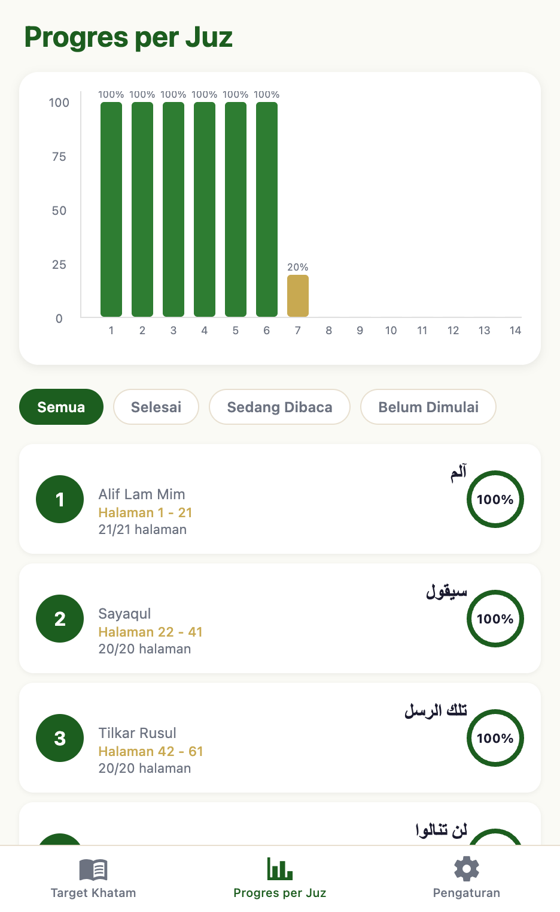
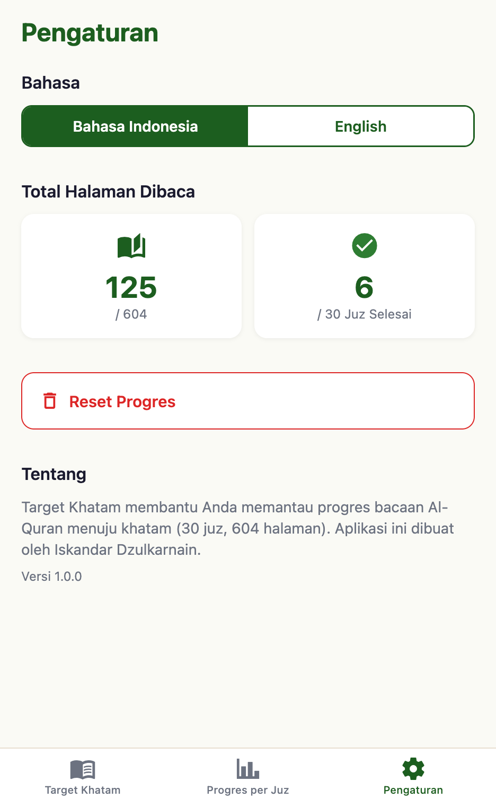

# 📖 Target Khatam

[](https://expo.dev)
[](https://reactnative.dev/)
[](https://www.typescriptlang.org/)

**Target Khatam** adalah aplikasi lintas platform (iOS, Android, Web) yang membantu Anda memantau progres bacaan Al-Quran menuju khatam lengkap 30 juz (604 halaman).

---

## ✨ Fitur Utama

- 📊 **Visualisasi Progres** - Grafik ringkas untuk melihat kemajuan bacaan Anda
- 📅 **Rekap Harian** - Analisis bacaan harian untuk 7, 14, atau 30 hari terakhir
- 📖 **Detail per Juz** - Pantau progres setiap juz dengan detail halaman
- 🌍 **Multibahasa** - Tersedia dalam Bahasa Indonesia dan English
- 💾 **Penyimpanan Lokal** - Data tersimpan aman di perangkat Anda
- 🎯 **Motivasi** - Pesan motivasi dinamis berdasarkan progres Anda
- 📱 **Responsive** - Berfungsi sempurna di mobile, tablet, dan desktop

---

## 🖼️ Screenshot

<div align="center">
  
  
  
</div>

---

## 🚀 Memulai Development

### Prerequisites

- **Node.js** 18+ dan npm
- **Expo CLI** (akan terinstall otomatis)
- **iOS Simulator** (untuk Mac) atau **Android Studio** (untuk Android development)

### Instalasi

1. **Clone repository**

   ```bash
   git clone https://github.com/yourusername/target-khatam.git
   cd target-khatam
   ```

2. **Install dependencies**

   ```bash
   npm install
   ```

3. **Jalankan aplikasi**

   ```bash
   # Web
   npm run web

   # iOS (Mac only)
   npm run ios

   # Android
   npm run android

   # Development mode
   npm start
   ```

---

## 📦 Build & Deploy

### Build untuk Web (Static)

```bash
npx expo export --platform web
```

File static akan tersedia di folder `dist/`. Siap untuk deploy ke:

- ✅ Netlify
- ✅ Vercel
- ✅ GitHub Pages
- ✅ Shared Hosting (Apache/Nginx)

### Build untuk Mobile

```bash
# Build Android APK
npx eas build --platform android --profile preview

# Build iOS
npx eas build --platform ios --profile preview
```

---

## 🌐 Deployment

### Netlify / Vercel

File konfigurasi sudah disediakan:
- `_redirects` (Netlify)
- `vercel.json` (Vercel)

Upload folder `dist` atau hubungkan repository GitHub Anda.

### Shared Hosting (Apache)

1. Upload semua isi folder `dist` ke `public_html`
2. File `.htaccess` sudah otomatis ter-copy untuk handle SPA routing
3. Selesai! ✅

### GitHub Pages

1. Copy file `404.html` sudah tersedia di folder `dist`
2. Push folder `dist` ke branch `gh-pages`
3. Enable GitHub Pages di repository settings

---

## 🛠️ Tech Stack

- **Framework**: [Expo](https://expo.dev) + [React Native](https://reactnative.dev)
- **Language**: [TypeScript](https://www.typescriptlang.org/)
- **Routing**: [Expo Router](https://docs.expo.dev/router/introduction/)
- **State Management**: React Context API
- **Storage**: AsyncStorage
- **Charts**: [react-native-gifted-charts](https://github.com/Abhinandan-Kushwaha/react-native-gifted-charts)
- **UI Components**: Custom components with Expo Icons

---

## 📂 Struktur Project

```
target-khatam/
├── app/                    # File-based routing (Expo Router)
│   ├── (tabs)/            # Tab navigation screens
│   ├── juz/[id].tsx       # Dynamic juz detail screen
│   └── _layout.tsx        # Root layout
├── components/            # Reusable components
├── context/               # React Context (ProgressContext, LanguageContext)
├── i18n/                  # Internationalization (en.ts, id.ts)
├── services/              # Data services (storage, progress logic)
├── constants/             # App constants and themes
├── hooks/                 # Custom React hooks
├── types/                 # TypeScript type definitions
└── dist/                  # Production build (web)
```

---

## 🌍 Internationalization

Target Khatam mendukung 2 bahasa:
- 🇮🇩 Bahasa Indonesia (default)
- 🇬🇧 English

Untuk menambahkan bahasa baru, tambahkan file di folder `i18n/` dan update `LanguageContext`.

---

## 🤝 Kontribusi

Kontribusi sangat diterima! Silakan:

1. Fork repository ini
2. Buat branch fitur (`git checkout -b feature/AmazingFeature`)
3. Commit perubahan (`git commit -m 'Add some AmazingFeature'`)
4. Push ke branch (`git push origin feature/AmazingFeature`)
5. Buat Pull Request

---

## 📝 To-Do List

- [ ] Dark mode support
- [ ] Export/Import progress data
- [ ] Reminder notifications
- [ ] Share progress ke social media
- [ ] Streak tracking
- [ ] Audio bacaan Al-Quran integration

---

## 📄 License

Proyek ini dilisensikan di bawah **MIT License** - lihat file [LICENSE](LICENSE) untuk detail.

---

## 👨‍💻 Pembuat

**Iskandar Dzulkarnain**

- GitHub: [@iskaelcom](https://github.com/iskaelcom)
- Email: [hai@iskael.com]

---

## 🙏 Acknowledgments

- Al-Quran data structure based on standard Mushaf Madinah (604 pages)
- Icons by [Expo Icons](https://icons.expo.fyi/)
- Built with ❤️ using Expo & React Native

---

<div align="center">
  <p><strong>Semoga bermanfaat untuk perjalanan khatam Al-Quran Anda!</strong></p>
  <p>BarakAllahu fiikum 🤲</p>
</div>
